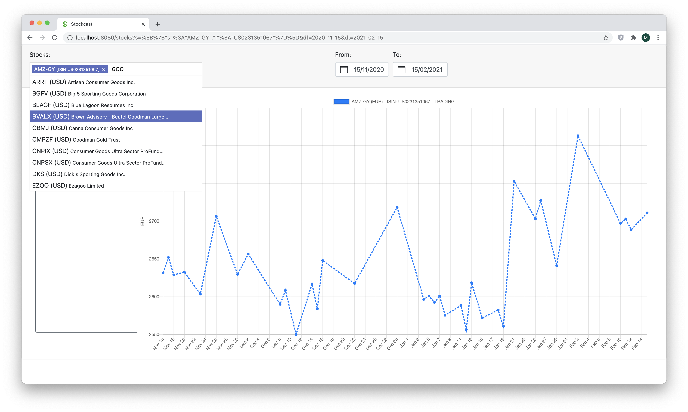
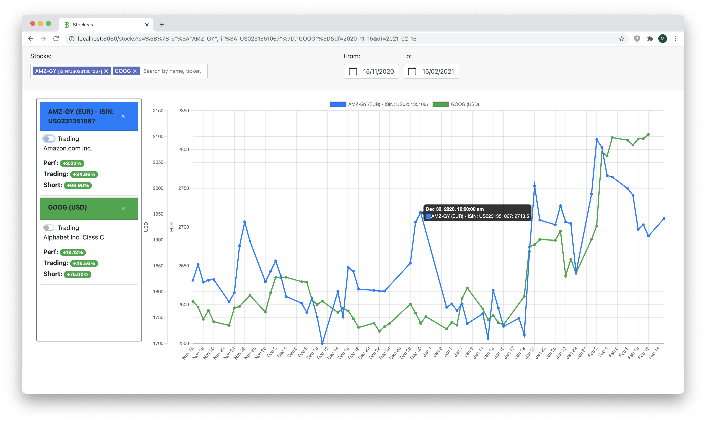
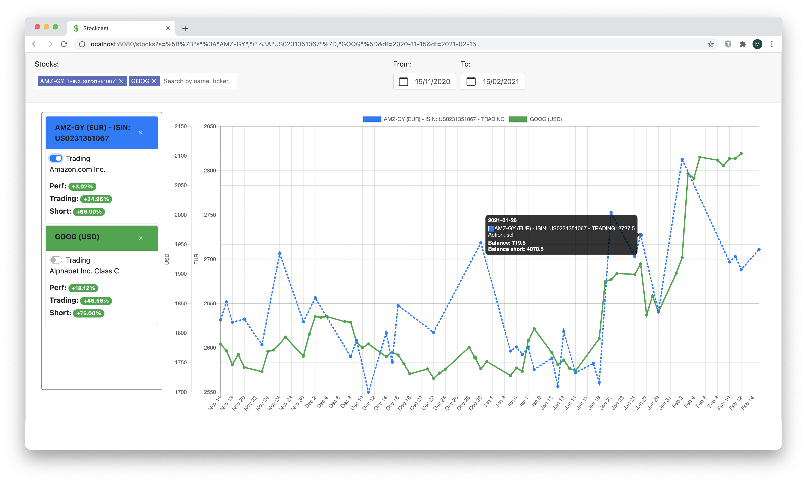

**This application is still WIP**. However, it can be already installed and run.

<!--ts-->
   * [About](#about)
   * [Usage](#usage)
      * [Search and display stock prices and performance](#search-and-display-stock-prices-and-performance)
      * [Trading view](#trading-view)
      * [Stock prices prediction](#stock-prices-prediction)
   * [Technical details](#technical-details)
      * [Data source](#data-source)
      * [Installation and setup](#installation-and-setup)
         * [Running locally with mix in dev or sandbox mode](#running-locally-with-mix-in-dev-or-sandbox-mode)
         * [Running with docker](#running-with-docker)
         * [Testing](#testing)

<!-- Added by: max, at: Wed Nov 11 21:08:24 CET 2020 -->

<!--te-->

# About

Visualize, analyze and predict stock prices

# Usage

## Search and display stock prices and performance

Search for stocks in the search bar and plot their prices on the chart in a given time period.

You can include up to 4 different stocks.

The cards on the left side display some information about the stock performance. Three values are shown:

* *Perf*: This is simply the change in the stock's price between the beginning and the end of the time period. In other words, this 
is how much money can be made (or lost) by buying the stock at the beginning of the time period and reselleing it at the end.
* *Trading*: This is the maximum performance that can be achieved (i.e. money that can be made) by trading in the
time period with perfect knowledge of future prices
* *Short*: This is the maximum performance that can be achieved by trading in the
time period with perfect knowledge of future prices and being able to [short the stock](https://en.wikipedia.org/wiki/Short_(finance))

## Trading view

Switching to trading mode in any of the cards turns on the trading view for the stock

In trading mode, the chart displays the detailed optimal trading strategy for that stock. Hovering on any stock's data point on the chart will show what the optimal action for that day is
(e.g. to *sell* or to *buy* the stock), as well as the balance that results from that action, both for normal and short trading.

## Stock prices prediction

Coming soon!

# Technical details

## Data source

Stockcast uses the [IEX Cloud API](https://iexcloud.io/) to retrieve financial data.

## Installation and setup

You will need to [sign up with IEX Cloud](https://iexcloud.io/cloud-login#/register/) and obtain an API token (yes, they do have a rather generous free access plan).

### Running locally with mix in dev or sandbox mode

**Dev mode** runs against the real IEX Cloud production API, whereas **sandbox mode** runs against the IEX Cloud sandbox 
 and doesn't consume your account's API calls, the downside being that the data is fake.

Prerequisites:

* Elixir >=1.10
* Mix and Hex installed
* Docker
* Node 13.7.0

After having cloned the repository, do the following:

* `cp secret.template.exs dev.secret.exs`
    * Uncomment the lines in `dev.secret.exs` and replace `#{YOUR_TOKEN_HERE}` with your IexCloud production token
* `cp secret.template.exs sandbox.secret.exs`
    * Uncomment the lines in `sandbox.secret.exs` and replace `#{YOUR_TOKEN_HERE}` with your IexCloud sandbox token
* Start the development database with: `docker-compose -f apps/stockcast/docker-compose.yaml up -d`

The following commands will execute in dev mode. 
If you want to run in sandbox mode the environment
variable MIX_ENV should be set to "sandbox" (e.g. `MIX_ENV=sandbox`)

* Setup the database: 
    * `cd apps/stockcast`
    * `mix ecto.setup`
    * `cd ../../`
* Run `mix fetch.symbols` to fetch the list of available financial securities from IEX Cloud. This might take a while.
  The sets of securities that will be fetched is configured in `config/config.exs` unde `Stockcast.IexCloud.Symbols` as a list of API endpoints.
  This results in a total of about 75k securities being installed.
  You can modify the list, and you can work your way through the available API endpoints for financial symbols [here](https://iexcloud.io/docs/api/#reference-data).
* Start the server with `mix phx.server`
* In another terminal, build and start the single page web application: 
  * `cd stockcast_spa`
  * `nvm use` to set the right node version to use (you might have to install, again using nvm)
  * `yarn`
  * `yarn serve`
* Access the application at `http://localhost:8080`

### Running with docker

Prerequisites:

* Docker

After having cloned the repository, do the following:

* In `docker-compose.yml`, replace `#{YOUR_TOKEN_HERE}` with your IexCloud production token
* Run `docker-compose up`
* Be patient...
* After a while, your application will be available at `http://localhost:4002`

### Testing

If you want to see some unit tests running, do the following:

* Start the development database with: `docker-compose -f apps/stockcast/docker-compose.yaml up -d`
* Run: `mix test`

For the backend tests, and:

* `cd stockcast_spa`
* `yarn test`

For the front-end tests.
